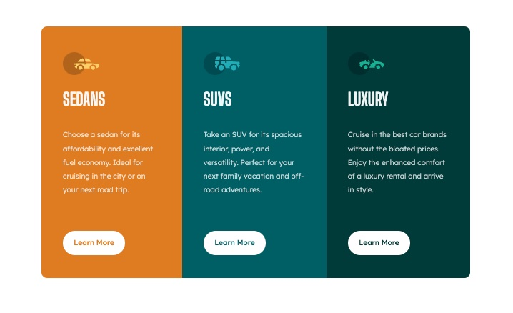
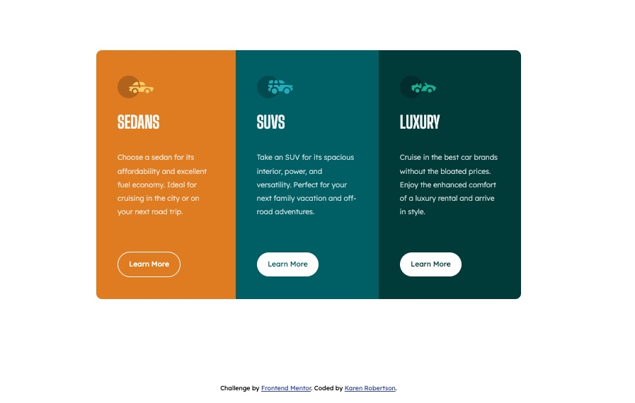
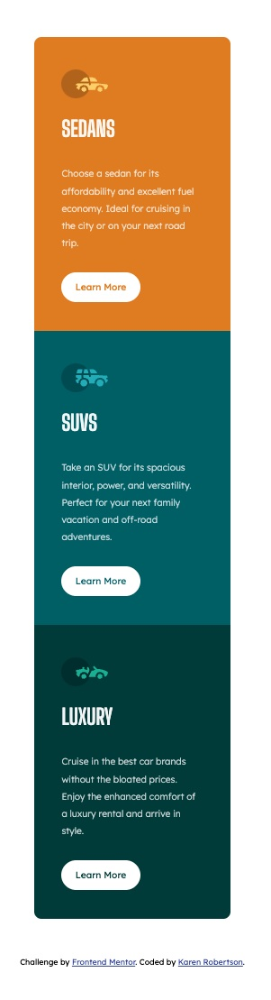
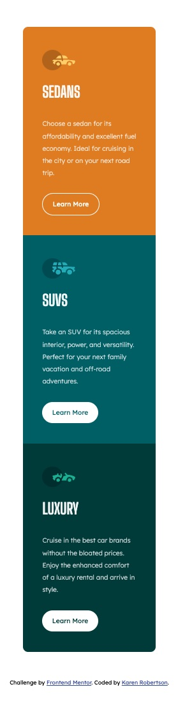

# Frontend Mentor - 3-column preview card component solution

This is a solution to the [3-column preview card component challenge on Frontend Mentor](https://www.frontendmentor.io/challenges/3column-preview-card-component-pH92eAR2-). Frontend Mentor challenges help you improve your coding skills by building realistic projects.

## Table of contents

- [Overview](#overview)
- [The challenge](#the-challenge)
- [Screenshot](#screenshot)
- [Links](#links)
- [My process](#my-process)
- [Built with](#built-with)
- [What I learned](#what-i-learned)
- [Continued development](#continued-development)
- [Useful resources](#useful-resources)
- [Author](#author)

## Overview

### The challenge

Users should be able to:

- View the optimal layout depending on their device's screen size
- See hover states for interactive elements

### Screenshot

### Links

- Solution URL: [Frontend Mentor Solution Site](https://www.frontendmentor.io/solutions/responsive-site-using-html-and-css-qTY4WHF56n)
- Live Site URL: [Live Site](https://three-preview-card-kr.netlify.app/)

## My process

This is a very simple use of HTML and CSS with flex-box styling as the base. I have been working on building sites from a mobile-first prospective and then using media queries for larger screens and desktop styling.

In this example, I have maintained the mobile styling up to 670px and then maintained the main card container with a max-width of 750px.

### Built with

- Semantic HTML5 markup
- Flexbox
- Mobile-first workflow

### What I learned

I have focused on trying to utilise the Don'tRepeatYourself (DRY) method with this code. Focusing on utilising the common HTML tags such as `<h1>` and `
` to make key changes.

I have also used the original svg tags for the icons rather than encasing within a image tag to remove unnecessary tags.

As such class names were primarily used so for either sizing, colorways or interactive elements of the cards.

### Continued development

Going forward, if it possible to refactor some of the css code and include any accessibility to the cards. I would also like to colorways and design factors.

### Useful resources

- [Kevin Powell's Conquering Responsive Layouts Course](https://courses.kevinpowell.co/conquering-responsive-layouts) - This helped me understand mobile-first design and css interactions. It has been a fun 30-day course with practical examples and hands-on experiences.

## Author

- Website - [Portfolio Site](https://krobertsondev.netlify.app/)
- Frontend Mentor - [@indigorose](https://www.frontendmentor.io/profile/indigorose)
